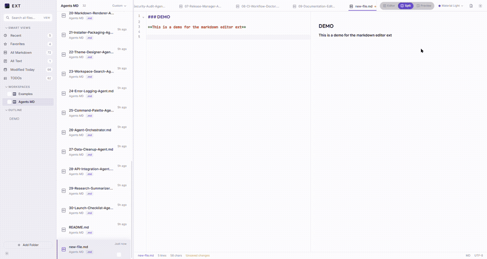
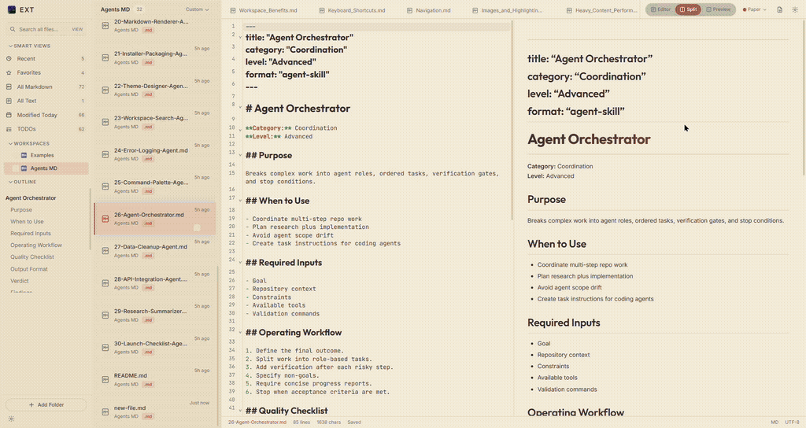

# EXT

EXT is a local-first workspace for Markdown and plain text files.

It does not import your notes into a proprietary database. It opens folders that already exist on your computer, scans for `.md` and `.txt` files, and gives you a fast place to read, search, edit, and organize them.

Your files stay where they are. You can keep using Git, OneDrive, Dropbox, Obsidian, VS Code, Notepad, or any other tool alongside EXT.

## What EXT is

EXT is built for people who already have Markdown or text files spread across projects, notes, docs, and repositories.

It gives you:

- one place to browse local Markdown and text files
- fast filename search
- smart views for common file groups
- a clean editor and Markdown preview
- basic file management
- a polished desktop UI
- direct control over your data

## Example

Here is a quick look at EXT in action:





## What EXT is not

EXT is not a cloud notes platform, publishing service, collaboration suite, AI workspace, or replacement for every Markdown editor.

There are no accounts, hosted documents, proprietary sync layers, or hidden note databases. If you want sync, use the filesystem tools you already trust, such as Git, OneDrive, Dropbox, or Syncthing.

## Features

### Local-first workspaces

- Add existing folders as workspaces.
- EXT scans local folders directly.
- Only `.md` and `.txt` files are shown in the workspace file list.
- Common noisy directories such as `.git`, `node_modules`, and build output folders are ignored.
- Files can still be opened and edited by other applications.

### File management

- Create new Markdown or text files.
- Create folders.
- Rename files.
- Delete files with confirmation.
- Reveal files in the system file explorer.
- Copy absolute file paths.
- Remove workspaces without deleting the files on disk.

### Smart views

The sidebar provides quick views for common workflows:

- Recent
- Favorites
- All Markdown
- All Text
- Modified Today
- TODOs

### Search

EXT includes a fast global search bar for finding files by name across connected workspaces.

### Editor and preview

- CodeMirror 6 editor.
- Autosave to local disk.
- Saved/unsaved state indicator.
- Editor Only, Split View, and Preview Only modes.
- GitHub-Flavored Markdown preview.
- Markdown outline for heading navigation.
- Local image rendering in preview when valid Markdown image paths are used.

Image files are not added to the workspace file list and EXT does not manage image assets.

### Tabs and navigation

- Open multiple files.
- Switch between files through tabs.
- Use keyboard shortcuts for common actions.
- Use focus mode when you want the editor to take over the screen.

### Themes and visual settings

EXT includes a theme system with built-in themes and custom palette support.

Visual polish can be configured from settings, including animations, transitions, editor focus effects, sidebar effects, and reduced-motion behavior.

### System tray

Closing the window can minimize EXT to the system tray instead of quitting. From the tray, users can:

- Open the app
- Restart the app
- Exit the app

Unsaved changes are protected before restart or exit.

### First-run examples

On first launch, EXT creates an Examples workspace with sample Markdown files so new users can try the app without setting up their own folder first.

## Tech stack

- Tauri v2
- Rust backend
- React frontend
- TypeScript
- Vite
- CodeMirror 6
- markdown-it
- DOMPurify

## Development

### Prerequisites

- Node.js
- Rust stable
- Tauri system prerequisites for your operating system

### Install

```bash
npm install
```

### Run in development

```bash
npm run dev
```

If the project uses a separate Tauri script in `package.json`, use that script instead.

## Downloads

Prebuilt installers are attached to GitHub Releases.

Available packages:

- Windows: `.msi`
- macOS: `.dmg`
- Linux: `.deb` and AppImage

Unsigned builds may show operating system security warnings. Code signing can be added later.

## Creating a Release

1. Update the version.
2. Commit the change.
3. Create and push a tag:

```bash
git tag v0.1.0
git push origin v0.1.0
```

4. GitHub Actions will build release artifacts.

## Building Installers Locally

```bash
npm install
npm run tauri:build
```

Generated bundles are written under:

```text
src-tauri/target/release/bundle/
```

Platform-specific packages are best built on their native OS:

- Windows installers on Windows
- macOS DMG on macOS
- Linux packages on Linux

## Quality checks

Frontend:

```bash
npm run test
npm run build
```

Backend:

```bash
cd src-tauri
cargo fmt --check
cargo clippy -- -D warnings
cargo test
```

The repository includes GitHub Actions workflows for frontend and Rust/Tauri checks on pushes and pull requests.

## Documentation

- `DESIGN.md` explains the architecture.
- `CONTRIBUTING.md` explains contribution rules and review expectations.

## License

EXT is licensed under the **GNU General Public License v3.0 or later** (`GPL-3.0-or-later`).

You are free to use, study, modify, and fork EXT. Personal forks and open-source contributions are welcome.

If you distribute a modified version of EXT, you must keep it under the same license and provide the corresponding source code. This keeps EXT and its forks open instead of allowing closed-source rebrands.

The EXT name, logo, icon, screenshots, and other brand assets are not covered by the GPL license grant. Do not use them in a way that suggests your fork or modified build is the official EXT app.
